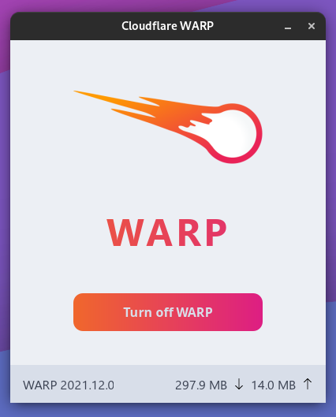

<h1 align="center">Cloudflare WARP GUI for Linux</h1>

<p align="center"></p>

<p align="center">This is unofficial GUI client for Cloudflare WARP. Now we don't have official one</p>

<br>

# Installation

1. Install [cloudflare-warp-bin](https://aur.archlinux.org/packages/cloudflare-warp-bin) AUR package *(or somehow else build [one of these packages](https://pkg.cloudflareclient.com/packages/cloudflare-warp))*
2. Run `warp-cli register` command
3. Download this project. Done

# Known issues

- [ ] Tray icon doesn't work with AppImage

# Development

## Clone repository

```zsh
git clone https://github.com/krypt0nn/warp-gui
cd warp-gui
yarn
```

## Run from source

```zsh
yarn dev
```

## Build

```zsh
yarn build
```

## Bundle to AppImage

```zsh
yarn bundle
```

<br>

Author: [Nikita Podvirnyy](https://vk.com/technomindlp)
